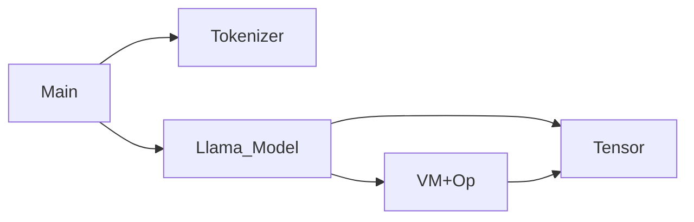

## AIC

Artificial Intelligence Compute or AI Infrastrutre Compute.

### Staring Project
This is a very simple pure c code to run llama 3 8B model.

### System

### Components

#### Tokenizer

---

***Algorithm*** This [blog post][1] provides a good introduction to the BPE
Algorithm with testing code. The only missing piece is the special tokens
handling, which is trivial to add.

***Implementation*** For the C implementation, there are few challenges
- _How to support word splitting regexp?_ I debate between manual state machine
  implementation and `PCRE2` library. The `llama.cpp` project uses former with
  quite a ton code to handle unicode. In the first implementation, I leverage
  `PCRE2` which means an external dependency is introduced.
- _How to avoid small memory allocations?_ Based on the research of many code
  bases, almost all implementations allocates strings after word splitting and
  during BPE merging. I guess these are due to the fact many high level
  programming languages encourage users to use strings as basic data types not a
  pointer with byte array lengths and do not provide low level primitives to
  support hashing etc. My implementation is almost zero allocation.
- _How to speed up the hash table lookup?_ To build a python mergeable rank hash
  table, it takes 57ms on my laptop. Any good c implementation can be cut under
  6ms. This largely affects the BPE algorithm as well. Again, most high level
  programming languages provide _slow_ hashing functions which are targeted
  different use cases. I used a simple algorithm and monitored the conflicting
  rates. It serves the purpose very well. In future, SIMD could be used to
  further optimize the performance if needed.

***References*** Recommended readings:
- Eli's [blog post][1].
- Meta's [llama model tokenizer](https://github.com/meta-llama/llama-models/blob/5fdf83110cc9daa7435dfba6eb304892cc0041b8/models/llama3/tokenizer.py).
- OpenAI's [tiktoken library](https://github.com/openai/tiktoken).
- Llama.cpp's [vocab code](https://github.com/ggml-org/llama.cpp/blob/de569441470332ff922c23fb0413cc957be75b25/src/llama-vocab.cpp).

[1]: https://eli.thegreenplace.net/2024/tokens-for-llms-byte-pair-encoding-in-go/

---

#### Tensor

---

__TL;DR__ Underlying it is more like a pointer to some raw buffer. Use with
care.

Tensor is a reference counting data structure. Most properties are embedded
locally, such as tensor shape (`shape`), reference count (`ref_cnt`) and data
type (`dtype`). The only indirection is data pointer. In case the tensor borrows
the data, `alias` field is set as `1`.

---

